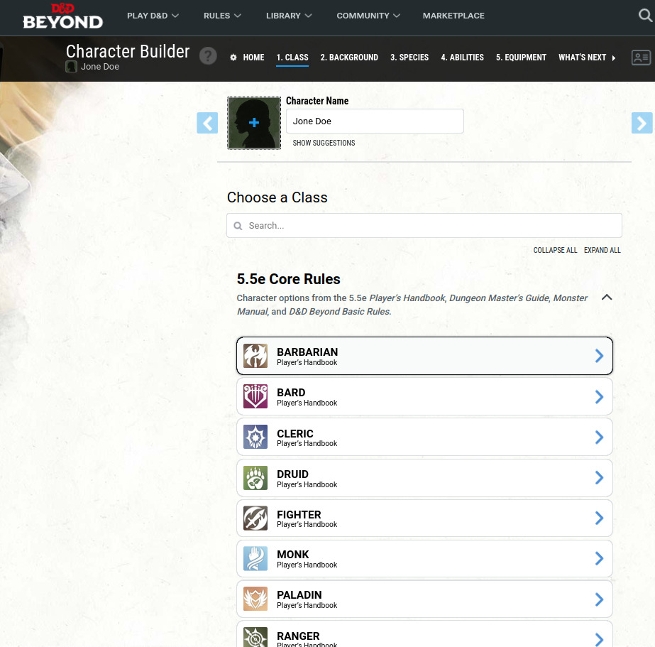
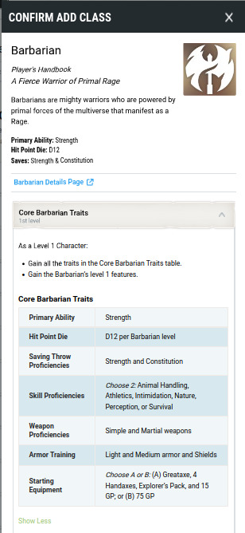
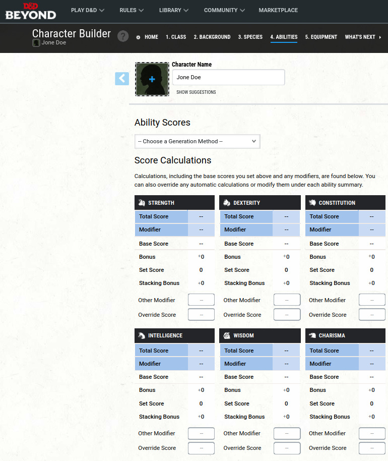
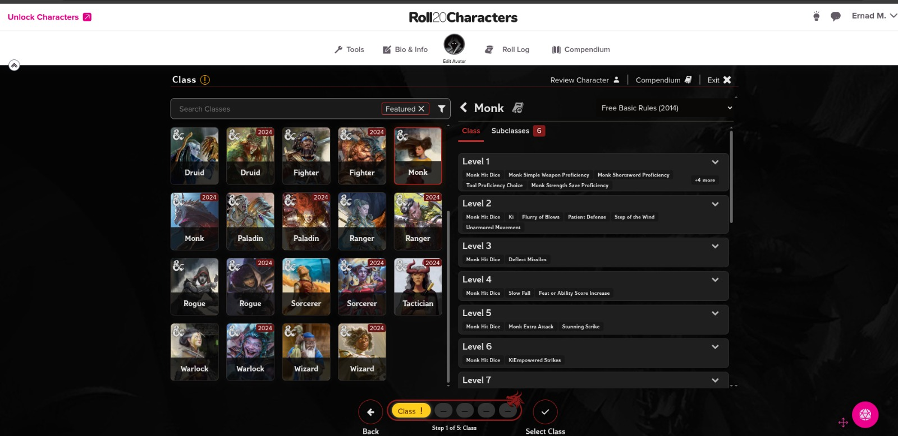
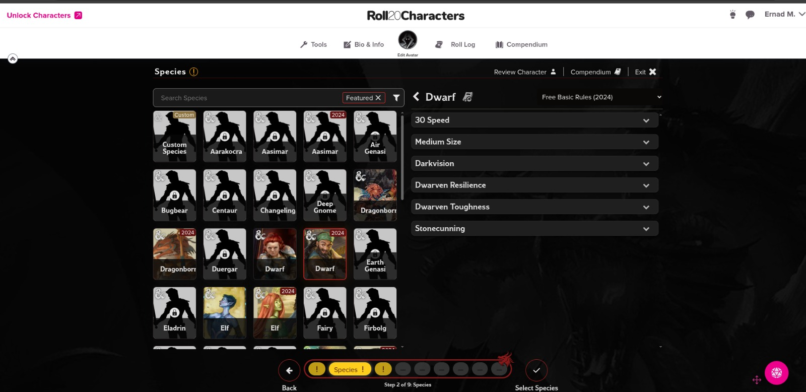

= DnD Character Builder
Daryan Mamsaleh, Leon Marazovic, Deniz Becer, Marko Trkulja, Ernad Music
1.0.0, {docdate}: Some notes
ifndef::imagesdir[:imagesdir: images]
//:toc-placement!:  // prevents the generation of the doc at this position, so it can be printed afterwards
:sourcedir: ../src/main/java
:icons: font
:sectnums:    // Nummerierung der Überschriften / section numbering
:toc: left

//Need this blank line after ifdef, don't know why...
ifdef::backend-html5[]

// https://fontawesome.com/v4.7.0/icons/
icon:file-text-o[link=https://raw.githubusercontent.com/htl-leonding-college/asciidoctor-docker-template/master/asciidocs/{docname}.adoc] ‏ ‏ ‎
icon:github-square[link=https://github.com/htl-leonding-college/asciidoctor-docker-template] ‏ ‏ ‎
icon:home[link=https://htl-leonding.github.io/]
endif::backend-html5[]

// print the toc here (not at the default position)
//toc::[]

== Pflichtenheft "Was mache ich"

=== Ausgangssituation

Dungeons & Dragons (D&D) ist ein gemeinsames Rollenspiel, bei dem eine Gruppe eine Geschichte erlebt.
Eine Person ist der Spielleiter (Dungeon Master), der die Abenteuer erfindet und die Spielwelt leitet.
Die Mitspieler steuern eigene Charaktere, die sie selbst erstellen.
Jeder Charakter hat Eigenschaften (z. B. Stärke oder Intelligenz), einen Hintergrund, gehört zu einem Volk (z. B. Mensch, Elf, Zwerg) und wählt eine Klasse.
Die Klasse bestimmt, was der Charakter gut kann, etwa Kämpfer, Magier oder Schurke.
Gemeinsam erlebt die Gruppe Abenteuer, trifft Entscheidungen und löst Probleme, die vom Dungeon Master erstellt werden.
Würfel entscheiden oft darüber, ob Aktionen gelingen, was das Spiel spannend und unvorhersehbar macht.

=== Istzustand

Aktuell kann man diese Charaktere manuell in Form von Stift und Papier verfassen oder online einen Charakter erstellen, mit verschiedensten Fähigkeiten und Eigenschaften.
Dabei muss man für die Erstellung selbst viel recherchieren, welche Klassen oder Völker welche Eigenschaften haben.

=== Problemstellung

Es gibt nur wenige einsteigerfreundliche D&D-Character-Builder.
Viele kostenlose Varianten sind unübersichtlich aufgebaut oder bieten nur einen eingeschränkten Funktionsumfang.
Oft fehlen wichtige Inhalte wie Klassen, Völker oder Fähigkeiten, wodurch die Erstellung eines vollständigen Charakters erschwert wird.
Zusätzlich ist die Navigation in manchen Tools kompliziert, was besonders für Anfänger den Einstieg erschwert.

Bei D&D Beyond ist die Benutzeroberfläche zwar modern, jedoch werden viele Fachbegriffe und Spielmechaniken nicht ausreichend erklärt.
Begriffe wie Attribute, Modifikatoren oder Saving Throws sind für Anfänger schwer verständlich.
Auch die Wahl passender Werte und Fähigkeiten ist ohne Vorkenntnisse kompliziert und kann schnell überfordernd wirken.
Zudem sind viele Inhalte nur gegen Bezahlung verfügbar.

Bei Roll20 besteht das Problem, dass nicht alle verfügbaren Inhalte vollständig genutzt werden können, obwohl sie im System vorhanden sind.
Zusätzlich gibt es eine große Auswahl an Klassen und Völkern, deren Unterschiede und Eigenschaften für Einsteiger nicht klar ersichtlich sind.
Dadurch fällt es schwer zu verstehen, welche Rolle eine Klasse im Spiel übernimmt.

=== Aufgabenstellung

Es soll ein Charakter-Editor entwickelt werden, welcher als übersichtliches Werkzeug für die Erstellung von Spielfiguren dient.
Zusätzlich soll der Editor neue Spieler dabei unterstützen, ein besseres Verständnis für die Funktionen, Fähigkeiten und Eigenschaften ihres eigenen Charakters zu erlangen.
Dabei werden die Daten in Form einer Oracle-Datenbank von uns selber zur verfügung gestellt, welche die Informationen vom offiziellen "DnD Player Handbook" original wiedergeben.

==== Funktionale Anforderungen

[plantuml,wireframe,png]
----
@startuml
actor Benutzer

rectangle "Charakter Editor" {
  usecase "Charakter erstellen" as createCharacter
  usecase "Charakterübersicht anzeigen" as viewCharacters

  usecase "Charakter bearbeiten" as editCharacter
  usecase "Charakter löschen" as deleteCharacter
  usecase "Charakter exportieren" as exportCharacter
  usecase "Regeln und Features lesen" as viewRules
  usecase "Charakter verwalten" as manageCharacter
}

Benutzer -- createCharacter
Benutzer -- viewCharacters
Benutzer -- exportCharacter
Benutzer -- viewRules
Benutzer -- manageCharacter

manageCharacter ..> editCharacter : <<include>>
manageCharacter ..> deleteCharacter : <<include>>

@enduml
----

==== Nichtfunktionale Anforderungen (NFA)

Die Benutzeroberfläche muss so schlicht gestaltet sein, dass Einsteiger ohne Vorkenntnisse einen Charakter erstellen können.
Optisch orientiert sich das Design am D&D-Farbschema, welches primär aus folgenden vier Farbtönen besteht:
Beige (Hintergrund), Dunkelrot (Überschriften/Akzente), Tusche-Schwarz (Text) und Gold/Messing (Icons/Rahmen).

=== Ziele

Die Ziele des Projekts sind, die Charaktererstellung für den Neuanfänger zu vereinfachen und übersichtlich zu gestalten.
Durch eine geführte Erstellung ist kaum Vorwissen erforderlich.
Die strukturierte Darstellung ermöglicht eine schnelle Charaktererstellung und reduziert den Zeitaufwand erheblich, da das mühsame Nachschlagen von Regeln, Klassen-Details oder Volks-Eigenschaften komplett entfällt.

=== Mengengerüst

* Erwartete Gesamtbenutzerzahl: 1 Benutzer
* Maximale gleichzeitige Benutzer: 1
* Durchschnittliche Charaktererstellungen pro Tag: 1-2
* Durchschnittliche Sitzungsdauer: 10–20 Minuten
* Speicherbedarf pro Charakter: gering

=== Rahmenbedingungen

Das Projekt wird als Gruppenarbeit von fünf Personen im Rahmen des Schuljahres durchgeführt.
Die Umsetzung erfolgt in Java unter Verwendung von JavaFX für die Benutzeroberfläche..

